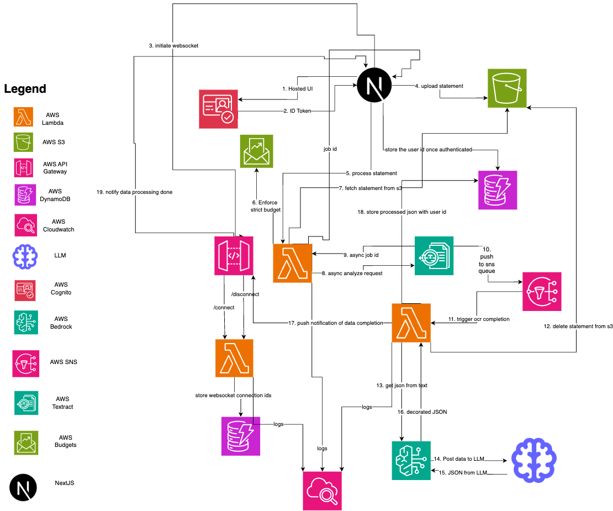

# Watch-Your-Spend

This app aims to analyze your bank/credit-card statements, to give you a better understanding of your spending habits. It uses AI to analyze the statement, and displays a dashboard with various insights on your spending. It is a cloud-native application, serverless architecture involving lambda functions. The front-end uses NextJS with edge processed server components, to display the data.

### Tech Stack:

1. AWS Lambda with Lambda layers - to process the pdf file and extract data.
2. AWS SNS - to send notification to lambda function that processing is over.
3. AWS S3 - simple upload of pdf file, then deleting it later.
4. AWS Bedrock - AI to analyze the data, in a streamed conversational way.
5. AWS API Gateway - to manage the web socket connections.
6. AWS DynamoDB - to store the data from the AI Agent as well as the web socket connections.
7. AWS Cloudwatch - to monitor the lambda functions and display logs.
8. AWS Textract - to extract the data from the pdf file using OCR.
9. Next.js - to create a front end for the application, with server components and edge processing.
10. Vercel - to deploy the front end application.
11. AWS Cognito - to authenticate the user and handle auth workflows.
12. AWS Budgets - to set up budgets and alerts.

### Architecture diagram

